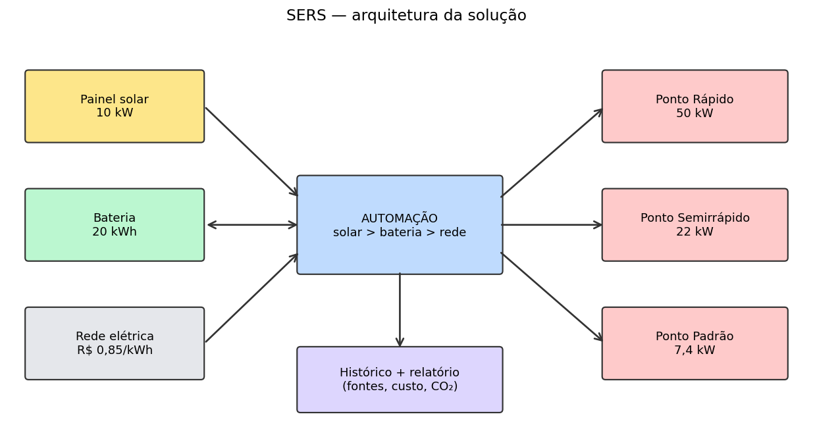
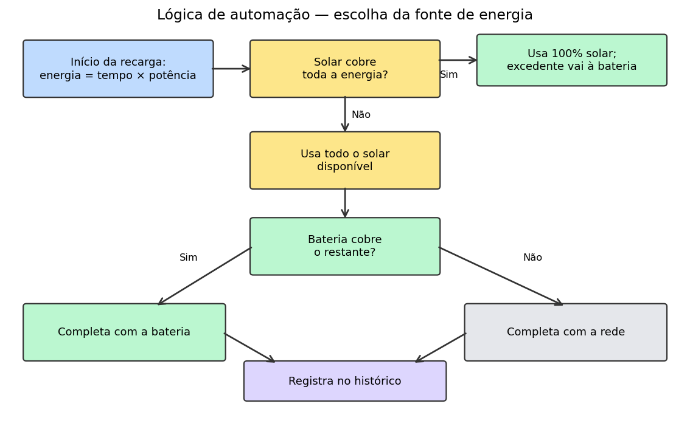
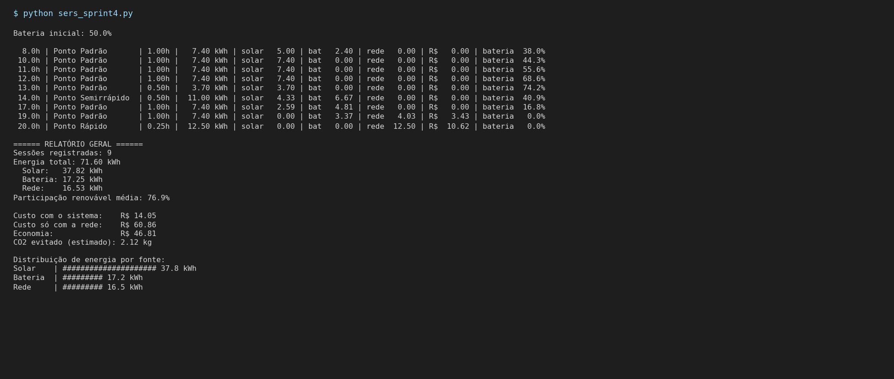
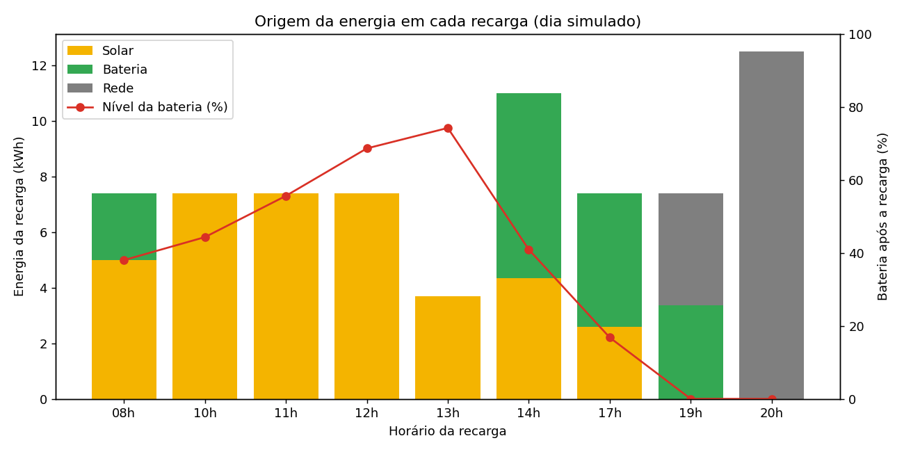
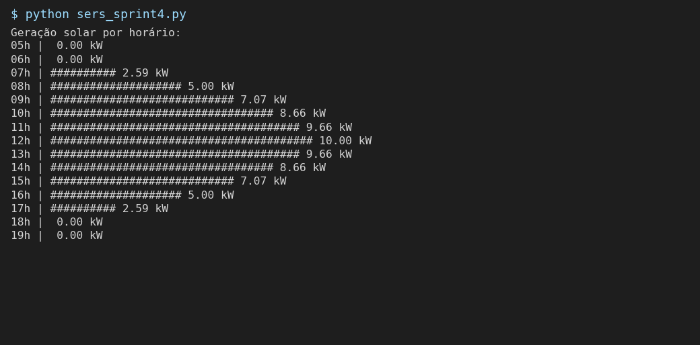
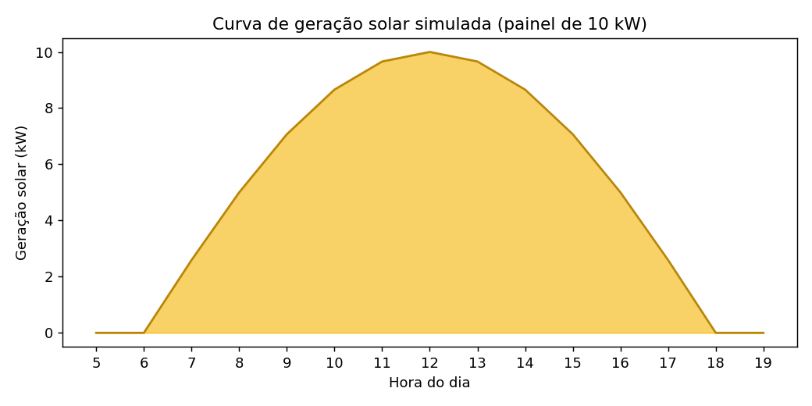

# Gestão Sustentável de Eletropostos

> Sprint 4 – Entrega Final · Desafio GoodWe

## Equipe
-Felipe Perdigão Macedo RM570990

-Felipe Mitsuo Takahashi Stephano RM570692

-Laura Godoy Callegari RM569181

-Letícia Araújo Espindola RM569308

-Mariana Dreset Carbollan RM569207

-Milena de Aguiar Lopes Cardoso RM570599


**Vídeo técnico:** _link do YouTube (não listado)_

---

## 1. Visão geral

Sistema em Python que simula a operação de uma estação de recarga de veículos elétricos com **geração solar, armazenamento em bateria e rede elétrica**, priorizando sempre a fonte renovável. O programa decide automaticamente de onde vem a energia de cada recarga, registra o histórico e gera um relatório com **economia financeira** e **estimativa de CO₂ evitado**.

**Regra central de automação:** `solar → bateria → rede`

1. A energia solar disponível atende a recarga primeiro.
2. Se sobrar solar, o excedente carrega a bateria.
3. Se faltar, a bateria complementa.
4. Só o que ainda faltar é comprado da rede.

---

## 2. Arquitetura da solução



*Figura 1 – Arquitetura final: painéis solares, bateria, rede elétrica, gerenciador de energia e eletropostos.*

### Fluxograma da automação



*Figura 2 – Lógica de decisão de cada recarga: solar → bateria → rede.*

### Componentes do código

| Função | Papel |
|--------|-------|
| `gerar_energia_solar(hora)` | Modela a geração com curva senoidal entre 6h e 18h (pico às 12h = 10 kW) |
| `carregar_bateria` / `descarregar_bateria` | Controlam o estado de carga respeitando capacidade e nível mínimo (0) |
| `simular_recarga(...)` | Aplica a lógica solar → bateria → rede e registra a sessão |
| `simular_dia()` | Roda 9 recargas pré-definidas ao longo do dia (opção 1 do menu) |
| `gerar_relatorio()` | Consolida energia por fonte, custo, economia e CO₂ evitado |
| `mostrar_barra` / `mostrar_curva_solar` | Gráficos em texto (visualização de dados no terminal) |

### Parâmetros do sistema

| Parâmetro | Valor |
|-----------|-------|
| Capacidade dos painéis | 10 kW |
| Capacidade da bateria | 20 kWh (inicia em 50%) |
| Tarifa da rede | R$ 0,85/kWh |
| Fator de emissão da rede | `FATOR_EMISSAO_REDE` (kg CO₂/kWh) — ver nota na seção 6 |

---

## 3. Como executar

Requer apenas Python 3.8+ (sem dependências externas).

```bash
python eletropostos.py
```

| Opção | Ação |
|-------|------|
| 1 | Simula um dia inteiro automaticamente e mostra o relatório |
| 2 | Simula uma recarga digitando hora, eletroposto e tempo |
| 3 | Mostra geração solar atual e nível da bateria |
| 4 | Gera o relatório do histórico |
| 5 | Mostra a curva de geração solar |
| 6 | Sair |

---

## 4. Alinhamento ao desafio GoodWe e à disciplina

A solução reproduz, em simulação, a lógica de um sistema **fotovoltaico híbrido com armazenamento** aplicado à mobilidade elétrica, que é o tipo de arquitetura trabalhada pela GoodWe (inversores híbridos, baterias de armazenamento, monitoramento via plataforma em nuvem e carregadores para veículos elétricos).

| Elemento do desafio | Como a solução responde |
|---------------------|-------------------------|
| Geração renovável | Curva solar modelada hora a hora |
| Armazenamento | Bateria que absorve excedente e cobre déficit |
| Uso inteligente | Priorização automática solar → bateria → rede |
| Monitoramento | Histórico por sessão, status da bateria, relatório e gráficos |
| Impacto mensurável | Economia em R$ e CO₂ evitado calculados contra o cenário "só rede" |

> **Ponto a completar pela equipe:** citar aqui os equipamentos GoodWe específicos usados como referência (modelo do inversor híbrido, bateria, wallbox, plataforma de monitoramento) e relacionar cada um a um conteúdo visto em aula. _Atenção: este código é uma simulação; não afirmar integração real com hardware ou API da GoodWe se ela não foi implementada._

---

## 5. Resultados

### Simulação de um dia inteiro (opção 1 do menu)



*Figura 3 – Saída do terminal com as 9 recargas simuladas e o relatório geral.*



*Figura 4 – Origem da energia (solar, bateria e rede) em cada recarga.*

### Curva de geração solar (opção 5 do menu)



*Figura 5 – Gráfico em texto da geração solar por horário, no terminal.*



*Figura 6 – Curva de geração solar ao longo do dia (pico de 10 kW às 12h).*

### Resultados quantitativos (preencher com a saída acima)

| Indicador | Valor |
|-----------|-------|
| Energia total fornecida | _x kWh_ |
| Parcela solar / bateria / rede | _x / x / x kWh_ |
| Participação renovável média | _x %_ |
| Custo com o sistema | _R$ x_ |
| Custo só com a rede | _R$ x_ |
| Economia | _R$ x_ |
| CO₂ evitado (estimado) | _x kg_ |

### Resultados qualitativos

- Nas horas de sol forte, as recargas do Ponto Padrão são atendidas totalmente pela solar e ainda sobra energia para a bateria.
- Em horários de sol fraco ou à noite, a bateria reduz a dependência da rede.
- Recargas de alta potência (Ponto Rápido) à noite dependem quase totalmente da rede, o que evidencia o valor de dimensionar melhor a bateria.

---

## 6. Avaliação crítica

### Benefícios
- **Sustentabilidade:** prioriza fonte renovável e quantifica o CO₂ evitado.
- **Economia:** reduz o consumo comprado da rede.
- **Automação:** a decisão de fonte é automática, sem intervenção do operador.
- **Transparência:** relatório e gráficos facilitam a comunicação dos ganhos.

### Limitações (assumidas e a considerar em melhorias)
- Geração solar é **modelada** por uma senoide, sem nuvens, sazonalidade ou dados reais.
- Não há perdas de conversão/eficiência na bateria nem limite de potência de carga/descarga.
- A bateria só é carregada com excedente solar (nunca pela rede em horário de tarifa baixa).
- Cada sessão é simulada isoladamente; não há recargas simultâneas disputando a mesma energia.
- Excedente solar acima da capacidade da bateria é descartado (não há injeção na rede).

### Nota sobre o fator de emissão
O valor de `FATOR_EMISSAO_REDE` no código (0,04 kg CO₂/kWh) é **provisório**. Antes de entregar, confirme o valor na fonte oficial (por exemplo, o fator médio do Sistema Interligado Nacional publicado pelo MCTI), atualize o código e cite a fonte e o ano aqui. Como a matriz brasileira é predominantemente renovável, o CO₂ evitado será pequeno em comparação com outros países, e isso deve ser dito com honestidade na análise.

### Inovação
- Algoritmo de priorização de fontes com visualização em texto.
- Simulação de um dia inteiro com um único comando.
- Relatório comparativo com cenário-base (sem solar).

### Próximos passos
Dados reais de irradiação/geração (ex.: via plataforma de monitoramento do inversor), tarifa horária, bateria carregando da rede fora do pico, interface gráfica/dashboard e integração com assistente virtual.

---

## 7. Tecnologias e referências

- **Linguagem:** Python 3 (bibliotecas padrão `math` e `datetime`)
- **Conceitos:** geração fotovoltaica, armazenamento, gestão de demanda, fator de emissão, simulação discreta
- **Referências:** _GoodWe (site/documentação dos produtos usados como referência)_, _fonte do fator de emissão (MCTI)_, _material da disciplina_

---

## 8. Estrutura do repositório

```
├── eletropostos.py
├── gerar_imagens.py                    
├── README.md
└── docs/
    ├── 01_arquitetura.png
    ├── 02_fluxograma_automacao.png
    ├── 03_terminal_simulacao_dia.png
    ├── 04_origem_energia_por_recarga.png
    ├── 05_terminal_curva_solar.png
    └── 06_curva_geracao_solar.png
```
